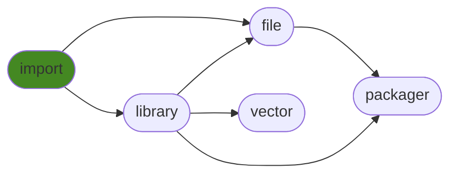

<details open>
<summary><h1>generalimport</h1></summary>

Handle all your optional dependencies with a single call!

<details>
<summary><h2>Table of Contents</h2></summary>

<pre>
<a href='#generalimport'>generalimport</a>
├─ <a href='#Dependency-Diagram-for-ManderaGeneral'>Dependency Diagram for ManderaGeneral</a>
├─ <a href='#Installation-showing-dependencies'>Installation showing dependencies</a>
├─ <a href='#Information'>Information</a>
├─ <a href='#Examples'>Examples</a>
│  ├─ <a href='#Minimal-Example'>Minimal Example</a>
│  ├─ <a href='#Tests-Showcase'>Tests Showcase</a>
│  ├─ <a href='#Recommended-Setup'>Recommended Setup</a>
│  └─ <a href='#How-It-Works'>How It Works</a>
├─ <a href='#Attributes'>Attributes</a>
└─ <a href='#Contributions'>Contributions</a>
</pre>
</details>


<details open>
<summary><h2>Dependency Diagram for ManderaGeneral</h2></summary>


</details>


<details open>
<summary><h2>Installation showing dependencies</h2></summary>

| `pip install`     | `generalimport`   |
|:------------------|:------------------|
| *No dependencies* | ✔️                |
</details>


<details open>
<summary><h2>Information</h2></summary>

| Package                                                          | Ver                                            | Latest Release        | Python                                                                                                                                                                                                                                                 | Platform        | Cover   |
|:-----------------------------------------------------------------|:-----------------------------------------------|:----------------------|:-------------------------------------------------------------------------------------------------------------------------------------------------------------------------------------------------------------------------------------------------------|:----------------|:--------|
| [generalimport](https://github.com/ManderaGeneral/generalimport) | [0.3](https://pypi.org/project/generalimport/) | 2022-10-27 16:21 CEST | [3.8](https://www.python.org/downloads/release/python-380/), [3.9](https://www.python.org/downloads/release/python-390/), [3.10](https://www.python.org/downloads/release/python-3100/), [3.11](https://www.python.org/downloads/release/python-3110/) | Windows, Ubuntu | 98.4 %  |
</details>


<details open>
<summary><h2>Examples</h2></summary>


<details open>
<summary><h3>Minimal Example</h3></summary>


Call `generalimport` before importing any optional dependencies.

```python
from generalimport import generalimport
generalimport("notinstalled")

from notinstalled import missing_func  # No error

missing_func()  # Error occurs here
```


```
MissingOptionalDependency: Optional dependency 'notinstalled' was used but it isn't installed.
```

Imports fail when they are **used**, *not* imported.

This means you don't need to keep checking if the package is installed before importing it.
Simply import your optional package and use it like you would any package and let it fail wherever it fails, with a nice error message.
</details>


<details>
<summary><h3>Tests Showcase</h3></summary>


The beauty of this package is that the error raised isn't just any exception.
It has two base classes: `unittest.case.SkipTest` and `_pytest.outcomes.Skipped` (If available).

This means that if a test method uses an uninstalled optional package then that test is automatically skipped.
This means no more manual skip decorators for optional dependencies!

```python
from generalimport import generalimport
generalimport("optional_uninstalled_package")

from optional_uninstalled_package import missing_func

from unittest import TestCase

class MyTest(TestCase):
    def test_missing_func(self):
        self.assertEqual(3, missing_func(1, 2))
```


```
Ran 1 test in 0.002s

OK (skipped=1)

Skipped: Optional dependency 'optional_uninstalled_package' was used but it isn't installed.
```
</details>


<details>
<summary><h3>Recommended Setup</h3></summary>


Put this in your `__init__.py` file to affect *all* imports inside the folder `__init__.py` resides in.

```python
from generalimport import generalimport
generalimport("your", "optional", "dependencies")
```


`generalimport("*")` makes it handle **all** names (If missing of course)

:warning: `generalimport("*")._scope = None` disables the scope
- Makes it handle missing imports anywhere
- For example it will override `pandas` internal custom optional dependency handling
</details>


<details>
<summary><h3>How It Works</h3></summary>


- When `generalimport` is instantiated it creates a new importer for `sys.meta_path`.
- This importer will return 'fake' modules for matching names and scope.
- The scope ensures only your own imports are faked.
- The fake module will recursively return itself when asked for an attribute.
- When used in any way (\_\_call\_\_, \_\_add\_\_, \_\_str\_\_ etc) it raises `generalimport.MissingOptionalDependency`.
- This exception has the 'skip-exceptions' from `unittest` and `pytest` as bases, which means that tests will automatically be skipped.
</details>

</details>


<details>
<summary><h2>Attributes</h2></summary>

<pre>
<a href='https://github.com/ManderaGeneral/generalimport/blob/master/generalimport/__init__.py#L1'>Module: generalimport</a>
├─ <a href='https://github.com/ManderaGeneral/generalimport/blob/master/generalimport/fake_module.py#L4'>Class: FakeModule</a>
│  └─ <a href='https://github.com/ManderaGeneral/generalimport/blob/master/generalimport/fake_module.py#L17'>Method: error_func</a>
├─ <a href='https://github.com/ManderaGeneral/generalimport/blob/master/generalimport/general_importer.py#L8'>Class: GeneralImporter</a>
│  ├─ <a href='https://github.com/ManderaGeneral/generalimport/blob/master/generalimport/general_importer.py#L23'>Method: catch</a>
│  ├─ <a href='https://github.com/ManderaGeneral/generalimport/blob/master/generalimport/general_importer.py#L47'>Method: create_module</a>
│  ├─ <a href='https://github.com/ManderaGeneral/generalimport/blob/master/generalimport/general_importer.py#L50'>Method: exec_module</a>
│  └─ <a href='https://github.com/ManderaGeneral/generalimport/blob/master/generalimport/general_importer.py#L31'>Method: find_spec</a>
├─ <a href='https://github.com/ManderaGeneral/generalimport/blob/master/generalimport/import_catcher.py#L6'>Class: ImportCatcher</a>
│  └─ <a href='https://github.com/ManderaGeneral/generalimport/blob/master/generalimport/import_catcher.py#L20'>Method: handle</a>
├─ <a href='https://github.com/ManderaGeneral/generalimport/blob/master/generalimport/exception.py#L13'>Class: MissingOptionalDependency</a>
├─ <a href='https://github.com/ManderaGeneral/generalimport/blob/master/generalimport_bottom.py#L62'>Function: fake_module_check</a>
├─ <a href='https://github.com/ManderaGeneral/generalimport/blob/master/generalimport/top.py#L14'>Function: generalimport</a>
├─ <a href='https://github.com/ManderaGeneral/generalimport/blob/master/generalimport/top.py#L10'>Function: get_importer</a>
├─ <a href='https://github.com/ManderaGeneral/generalimport/blob/master/generalimport_bottom.py#L7'>Function: get_installed_modules_names</a>
├─ <a href='https://github.com/ManderaGeneral/generalimport/blob/master/generalimport_bottom.py#L41'>Function: get_spec</a>
├─ <a href='https://github.com/ManderaGeneral/generalimport/blob/master/generalimport_bottom.py#L28'>Function: import_module</a>
├─ <a href='https://github.com/ManderaGeneral/generalimport/blob/master/generalimport_bottom.py#L13'>Function: module_is_installed</a>
├─ <a href='https://github.com/ManderaGeneral/generalimport/blob/master/generalimport_bottom.py#L47'>Function: module_is_namespace</a>
├─ <a href='https://github.com/ManderaGeneral/generalimport/blob/master/generalimport_bottom.py#L51'>Function: module_name_is_namespace</a>
├─ <a href='https://github.com/ManderaGeneral/generalimport/blob/master/generalimport/top.py#L36'>Function: reset_generalimport</a>
└─ <a href='https://github.com/ManderaGeneral/generalimport/blob/master/generalimport_bottom.py#L44'>Function: spec_is_namespace</a>
</pre>
</details>


<details open>
<summary><h2>Contributions</h2></summary>

Issue-creation, discussions and pull requests are most welcome!
</details>


<sup>
Generated 2023-01-15 09:43 CET for commit <a href='https://github.com/ManderaGeneral/generalimport/commit/master'>master</a>.
</sup>
</details>

