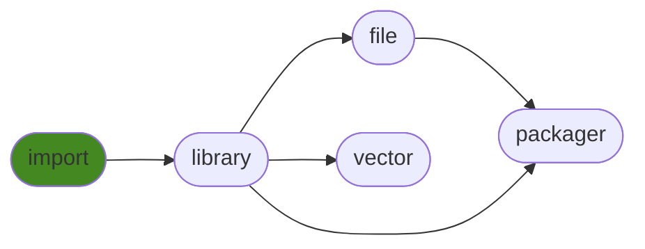

# generalimport
Handle all your optional dependencies with a single call!

## Contents
<pre>
<a href='#generalimport'>generalimport</a>
├─ <a href='#Dependency-Diagram'>Dependency Diagram</a>
├─ <a href='#Installation-showing-dependencies'>Installation showing dependencies</a>
├─ <a href='#Information'>Information</a>
├─ <a href='#Examples'>Examples</a>
│  ├─ <a href='#Minimal-Example'>Minimal Example</a>
│  ├─ <a href='#Tests-Showcase'>Tests Showcase</a>
│  ├─ <a href='#Recommended-Installation'>Recommended Installation</a>
│  └─ <a href='#How-It-Works'>How It Works</a>
├─ <a href='#Attributes'>Attributes</a>
├─ <a href='#Contributions'>Contributions</a>
└─ <a href='#Todo'>Todo</a>
</pre>

## Dependency Diagram


## Installation showing dependencies
| `pip install`     | `generalimport`   |
|:------------------|:------------------|
| *No dependencies* | ✔️                |

## Information
| Package                                                          | Ver                                              | Latest Release        | Python                                                                                                                                                                                  | Platform        | Cover   |
|:-----------------------------------------------------------------|:-------------------------------------------------|:----------------------|:----------------------------------------------------------------------------------------------------------------------------------------------------------------------------------------|:----------------|:--------|
| [generalimport](https://github.com/ManderaGeneral/generalimport) | [0.2.1](https://pypi.org/project/generalimport/) | 2022-10-07 16:07 CEST | [3.8](https://www.python.org/downloads/release/python-380/), [3.9](https://www.python.org/downloads/release/python-390/), [3.10](https://www.python.org/downloads/release/python-3100/) | Windows, Ubuntu | 97.6 %  |

## Examples

### Minimal Example

Call `generalimport` before importing any optional dependencies.

Here is a minimal example:

``` python
from generalimport import generalimport
generalimport("notinstalled")

import notinstalled  # No error

def func():
    notinstalled.missing_func()  # Error occurs here

func()
```


```
MissingOptionalDependency: Optional dependency 'notinstalled' was used but it isn't installed.
```

Imports fail when they are **used**, *not* imported.

This means you don't need to keep checking if the package is installed before importing it.
Simply import your optional package and use it like you would any package and let it fail wherever it fails, with a nice error message.

### Tests Showcase

The beauty of this package is that the error raised isn't just any exception.
It has two base classes: `unittest.case.SkipTest` and `_pytest.outcomes.Skipped` (If available).

This means that if a test method uses an uninstalled optional package then that test is automatically skipped.
This means no more manual skip decorators for optional dependencies!

``` python
from generalimport import generalimport
generalimport("optional_uninstalled_package")

from optional_uninstalled_package import missing_func

from unittest import TestCase

class MyTest(TestCase):
    def test_missing_func(self):
        self.assertEqual(3, missing_func(1, 2))
```


```
Ran 1 test in 0.002s

OK (skipped=1)

Skipped: Optional dependency 'optional_uninstalled_package' was used but it isn't installed.
```

### Recommended Installation

I recommend to put this at the top of your main `__init__.py` file.

``` python
from generalimport import generalimport
generalimport("your", "optional", "dependencies")
```

This is all you need to write to use this package.

You can also write `generalimport("*")` to make **any** package importable.

### How It Works


- When `generalimport` is instantiated it creates a new importer for `sys.meta_path`.
- This importer will return 'fake' modules for specified names.
- The fake module will recursively return itself when asked for an attribute.
- When used in any way (\_\_call\_\_, \_\_add\_\_, \_\_str\_\_ etc) it raises `generalimport.MissingOptionalDependency`.
- This exception has the 'skip-exceptions' from `unittest` and `pytest` as bases, which means that tests will automatically be skipped.

## Attributes
<pre>
<a href='https://github.com/ManderaGeneral/generalimport/blob/ba1b580/generalimport/__init__.py#L1'>Module: generalimport</a>
├─ <a href='https://github.com/ManderaGeneral/generalimport/blob/ba1b580/generalimport/fake_module.py#L4'>Class: FakeModule</a>
│  └─ <a href='https://github.com/ManderaGeneral/generalimport/blob/ba1b580/generalimport/fake_module.py#L14'>Method: error_func</a>
├─ <a href='https://github.com/ManderaGeneral/generalimport/blob/ba1b580/generalimport/general_importer.py#L12'>Class: GeneralImporter</a>
│  ├─ <a href='https://github.com/ManderaGeneral/generalimport/blob/ba1b580/generalimport/general_importer.py#L113'>Method: add_names</a> <b>(Untested)</b>
│  ├─ <a href='https://github.com/ManderaGeneral/generalimport/blob/ba1b580/generalimport/general_importer.py#L142'>Method: disable</a>
│  ├─ <a href='https://github.com/ManderaGeneral/generalimport/blob/ba1b580/generalimport/general_importer.py#L136'>Method: enable</a> <b>(Untested)</b>
│  ├─ <a href='https://github.com/ManderaGeneral/generalimport/blob/ba1b580/generalimport/general_importer.py#L83'>Method: find_module</a>
│  ├─ <a href='https://github.com/ManderaGeneral/generalimport/blob/ba1b580/generalimport/general_importer.py#L132'>Method: is_enabled</a> <b>(Untested)</b>
│  ├─ <a href='https://github.com/ManderaGeneral/generalimport/blob/ba1b580/generalimport/general_importer.py#L107'>Method: load_module</a>
│  └─ <a href='https://github.com/ManderaGeneral/generalimport/blob/ba1b580/generalimport/general_importer.py#L116'>Method: remove_names</a>
├─ <a href='https://github.com/ManderaGeneral/generalimport/blob/ba1b580/generalimport/exception.py#L13'>Class: MissingOptionalDependency</a>
├─ <a href='https://github.com/ManderaGeneral/generalimport/blob/ba1b580/generalimport/main.py#L22'>Function: check_import</a>
├─ <a href='https://github.com/ManderaGeneral/generalimport/blob/ba1b580/generalimport/main.py#L14'>Function: generalimport</a>
├─ <a href='https://github.com/ManderaGeneral/generalimport/blob/ba1b580/generalimport/main.py#L10'>Function: get_importer</a>
├─ <a href='https://github.com/ManderaGeneral/generalimport/blob/ba1b580/generalimport/module_funcs.py#L6'>Function: get_installed_modules_names</a>
├─ <a href='https://github.com/ManderaGeneral/generalimport/blob/ba1b580/generalimport/module_funcs.py#L27'>Function: import_module</a>
├─ <a href='https://github.com/ManderaGeneral/generalimport/blob/ba1b580/generalimport/module_funcs.py#L11'>Function: module_is_installed</a>
├─ <a href='https://github.com/ManderaGeneral/generalimport/blob/ba1b580/generalimport/module_funcs.py#L43'>Function: module_is_namespace</a> <b>(Untested)</b>
├─ <a href='https://github.com/ManderaGeneral/generalimport/blob/ba1b580/generalimport/module_funcs.py#L47'>Function: module_name_is_namespace</a>
└─ <a href='https://github.com/ManderaGeneral/generalimport/blob/ba1b580/generalimport/module_funcs.py#L40'>Function: spec_is_namespace</a> <b>(Untested)</b>
</pre>

## Contributions
Issue-creation and discussions are most welcome!

Pull requests are not wanted, please discuss with me before investing any time

## Todo
| Module                                                                                                                     | Message                                                                                                                                                          |
|:---------------------------------------------------------------------------------------------------------------------------|:-----------------------------------------------------------------------------------------------------------------------------------------------------------------|
| <a href='https://github.com/ManderaGeneral/generalimport/blob/master/generalimport/module_funcs.py#L1'>module_funcs.py</a> | <a href='https://github.com/ManderaGeneral/generalimport/blob/master/generalimport/module_funcs.py#L14'>Change back to find_spec if spec_is_namespace works.</a> |

<sup>
Generated 2022-10-07 16:07 CEST for commit <a href='https://github.com/ManderaGeneral/generalimport/commit/ba1b580'>ba1b580</a>.
</sup>
